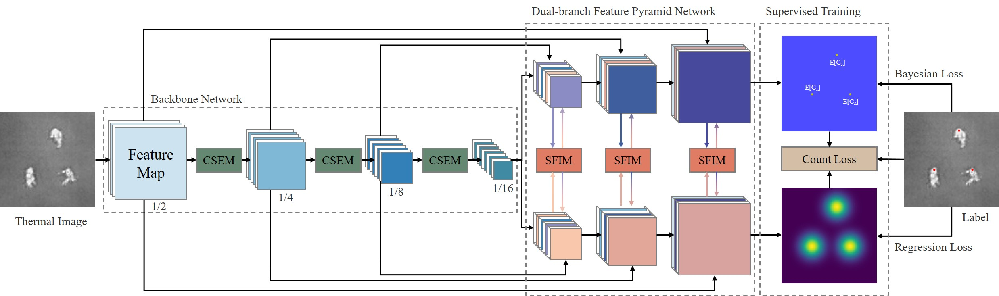

# ThermalCC

Robust Crowd Counting by Relying Solely on UAV Thermal Imaging.

## Overview



## Quick Start

### 1. Data Preparation

* Download the required datasets from the following public repositories: [DroneRGBT](https://github.com/VisDrone/DroneRGBT), [RGBT-CC](https://github.com/chen-judge/RGBTCrowdCounting).

* Extract the downloaded dataset files to the project root directory.

* Generate Focal Inverse Distance Transform Map:
```
python generate_dronergbt.py
python generate_rgbtcc.py
```

### 2. Hyperparameter Configuration

* All training hyperparameters are centrally managed in `config.py`.

### 3. Model Training

* Start model training:
```
python train.py
```

### 4. Model Training

* Model Inference:
```
python test.py
```
