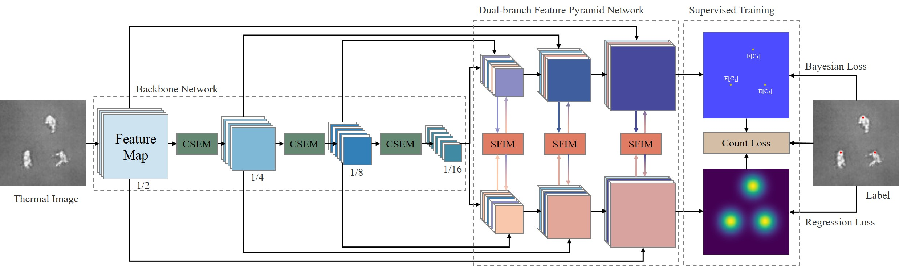

# ThermalCC

ThermalCC: Contextual Semantic Enhancement and Sensitive Feature Interaction Network for UAV Thermal Imaging-based Crowd Counting

## Overview

## Notes

* In this release, we have published the network code for ThermalCC. Please refer to `./network`.

* We plan to release the complete training code and model weights for ThermalCC in the near future.
